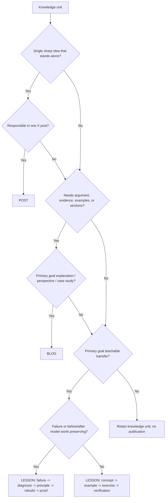
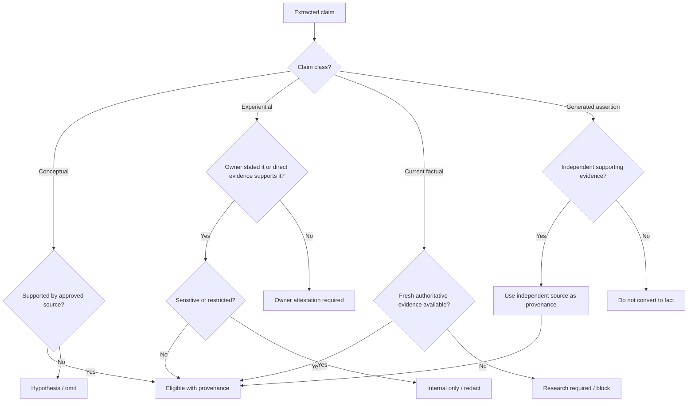
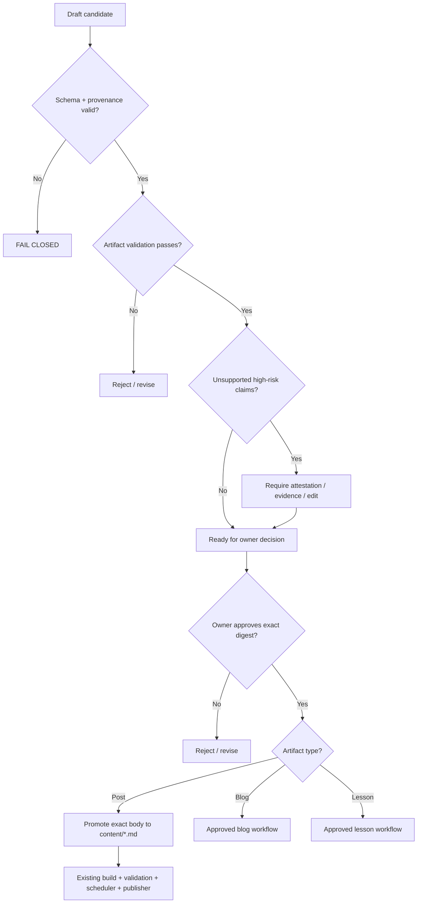

# XQueue Author: Content Distillation + Context Engine Architecture

**Status:** Phase 0 skeleton / proposed feature
**Tracking:** XQueue #75
**Target:** post-1.1.0 feature release (provisionally 1.2.0)
**Authority rule:** generation is not approval; approval is not publication authority.

## Purpose

XQueue Author turns source material into reusable knowledge and then into bounded content artifacts. Sources may include owner notes, ChatGPT/Claude output, GitHub issues and PRs, audits, project evidence, documents, transcripts, and read-only Context Engine retrieval.

The feature may propose a **post**, **blog**, or **lesson**. It must preserve provenance, distinguish generated assertions from evidence, and require exact owner approval before any candidate becomes authoritative content.

The existing XQueue 1.1.0 scheduler/publisher remains deterministic and independent of any model or Context Engine service.

## System boundary

```mermaid
flowchart LR
    P[Patrick / Owner] --> TOS[TOS Governance + Authority]

    subgraph CE[Context Engine - non-authoritative]
      S1[Conversations]
      S2[GitHub / audits]
      S3[Docs / notes]
      S4[Project evidence]
      ING[Ingestion + normalization]
      IDX[Provenance index + retrieval]
      S1 --> ING
      S2 --> ING
      S3 --> ING
      S4 --> ING
      ING --> IDX
    end

    TOS -->|governs scope and authority| CE

    subgraph XA[XQueue Author]
      CS[Context-source adapter]
      DIST[Distiller]
      KU[Knowledge units]
      PLAN[Artifact planner]
      GEN[Provider-neutral generator]
      VAL[Claim / policy / voice validation]
      REV[Owner review]
      CS --> DIST --> KU --> PLAN --> GEN --> VAL --> REV
    end

    IDX -->|read-only, provenance required| CS
    TOS -->|governs authoring authority| XA
    P -->|approve / reject / attest| REV

    REV -->|approved post| POST[content/*.md]
    REV -->|approved blog| BLOG[Approved blog artifact]
    REV -->|approved lesson| LESSON[Approved lesson / masterclass artifact]

    subgraph XR[Existing XQueue Runtime]
      BUILD[Build + existing validation]
      SCHED[Deterministic scheduler]
      PUB[Fail-closed publisher]
      LEDGER[Publication evidence]
      BUILD --> SCHED --> PUB --> LEDGER
    end

    POST --> BUILD
    REV -->|approved interpretation metadata only| FEED[Knowledge feedback]
    FEED --> CE
```



## Non-negotiable invariants

1. `content/*.md` remains the repository-controlled authoring/review history. Approved runtime content promoted into production D1 is the canonical publication source after #46.
2. The Context Engine is non-authoritative memory/retrieval support. It cannot approve content, mutate canonical production D1, or publish.
3. Generated text is evidence only that a generator produced text; it is not evidence that the contained claims are true.
4. Every durable source, knowledge unit, candidate, approval, and promotion must carry provenance.
5. Owner approval is bound to the exact candidate digest. Editing after approval invalidates approval.
6. A generated candidate cannot directly enter queue generation, scheduling, or publication.
7. Provider/network failure cannot mutate authoritative content or publication state.
8. Current XQueue policy validation is reused for posts; the feature must not create a weaker parallel policy path.
9. Blog and lesson workflows are separate artifact domains and have no publication authority over X.
10. XQueue runtime safety must remain functional if all AI providers and the Context Engine are unavailable.

## Responsibility split

| Component | Responsible for | Explicitly not responsible for |
|---|---|---|
| TOS | policy, authority, owner-reserved decisions | content generation |
| Context Engine | retrieval, persistence, provenance, reusable context | canonical truth by convenience, approval, publication |
| XQueue Author | distillation, artifact planning, candidate generation, validation | publication authority |
| Owner | experiential attestation, exact candidate approval, strategy changes | automated scheduling mechanics |
| Existing XQueue runtime | build, schedule, publish, ledger, recovery | AI generation or truth determination |

## Source pipeline

```text
source -> source record -> normalized segments -> claims/ideas -> knowledge units
       -> artifact plan -> draft candidate -> validation -> owner decision
       -> approved artifact -> artifact-specific promotion path
```

### Supported source classes

- `owner_input` — direct owner notes or attestations.
- `conversation` — ChatGPT, Claude, or other conversation exports.
- `github` — issues, PRs, comments, commits, CI evidence.
- `document` — reports, plans, notes, transcripts.
- `context_engine` — read-only Context Engine retrieval result.
- `generated_content` — AI-produced material that may contain useful ideas but is not truth evidence by itself.

### Trust classes

- `owner_attested` — owner explicitly states the claim as true.
- `authoritative_reference` — points to the actual governing/canonical source for the claim.
- `evidence` — supports a claim but may not itself be canonical.
- `generated` — model-produced interpretation or prose.
- `unverified` — useful for discovery only.

A `generated` or `unverified` source cannot independently promote an experiential or current-factual claim to supported status.

## Knowledge unit model

A knowledge unit is reusable intellectual property extracted from one or more sources. It is not itself a publication artifact.

Required concepts:

- stable `knowledge_unit_id`
- `kind`: lesson, principle, failure, decision, example, question, claim, framework, observation
- concise `summary`
- source references and supporting evidence
- claim class: conceptual, experiential, current-factual, generated-assertion
- support state: supported, owner-attestation-required, research-required, hypothesis, internal-only
- sensitivity / publication restrictions
- possible output kinds: post, blog, lesson
- used artifact references and remaining angles

This lets one verified lesson become a short post, a longer blog, and a teaching module without losing the original provenance.

## Artifact selection decision tree



## Claim-use decision tree



## Approval and promotion decision tree



## Lesson structure

A lesson must preserve the learning path instead of rewriting history as if the final answer was obvious:

1. objective / what was being built
2. original mental model or assumption
3. failure or contradiction
4. observed evidence
5. diagnosis
6. underlying concept/principle
7. rebuild or corrected design
8. negative tests / verification
9. transfer: where else the principle applies
10. optional exercise or architecture drill

If no real failure occurred, use concept -> example -> exercise -> verification, and never fabricate a failure story for narrative effect.

## Candidate states

```text
draft -> reviewable -> approved -> promoted
  |          |           |
  +-------> rejected <---+
```

Rules:

- `draft` cannot be promoted.
- `reviewable` means contracts and non-owner gates pass; it is still non-authoritative.
- `approved` requires an exact owner approval record bound to the candidate digest.
- changing candidate content after approval returns it to `draft`/`reviewable` and requires new approval.
- `promoted` records the authoritative artifact reference; promotion is idempotent for the same candidate and destination.

## Context Engine interface

XQueue Author depends only on a provider-neutral read interface, conceptually:

```js
await contextSource.retrieve({
  query,
  projects,
  sourceTypes,
  maxResults,
  requireProvenance: true,
  readOnly: true,
});
```

The adapter returns normalized source records. XQueue Author must not know whether the underlying implementation uses Supabase, Postgres, embeddings, files, GitHub, model memory, or another store.

Phase 0/1 must operate without the Context Engine. Manual/local source records are sufficient. Context Engine integration is additive, not a runtime prerequisite.

## Feedback to Context Engine

Only approved interpretation metadata is eligible for feedback. A feedback record may say:

- knowledge unit ID
- approved interpretation digest
- artifact type and artifact reference
- source references
- used angle(s)
- unused angle(s)
- owner approval reference

It must not silently rewrite or supersede the canonical source records from which the interpretation was derived.

## Storage layout

Proposed repository-local skeleton:

```text
authoring/
  contracts/
    source-record.schema.json
    knowledge-unit.schema.json
    artifact-candidate.schema.json
    approval.schema.json
  briefs/                 # future; staging, policy TBD
  prompts/                # future; versioned templates, no secrets
src/authoring/
  contracts.mjs
  context-source.mjs
  planner.mjs
```

Draft/source storage policy must be decided before sensitive material is committed. Default rule: do not commit private conversation bodies, secrets, unpublished sensitive evidence, or raw provider prompts merely to make the feature work.

## Privacy and data minimization

- ingest only sources needed for the requested authoring objective;
- preserve source locators/digests rather than copying sensitive bodies when possible;
- classify source sensitivity before sending it to a model provider;
- never log credentials or raw private prompt/source bodies in telemetry;
- artifact metadata may retain hashes, counts, provider/model identifiers, cost estimates, and source references;
- redact or block employment/client/private-person material unless explicitly permitted.

## Cost controls

- deterministic extraction/planning before model calls where practical;
- default 3 candidates, hard maximum 5 per generation request;
- provider budgets by request and by run;
- no provider call during ordinary `pnpm verify`;
- mock/static provider for CI;
- reuse distilled knowledge units rather than repeatedly reprocessing the same long source;
- content-address source and knowledge artifacts to avoid duplicate generation.

## Observability

Record without leaking source bodies:

- run ID
- input digests and source refs
- stages entered/exited
- knowledge units created/reused
- artifact plans created
- provider/model/prompt version
- candidate count
- validation finding counts
- owner decision refs
- cost/token estimates where available
- final artifact refs
- fail-closed reason codes

## Failure rules

- Context Engine unavailable -> local/manual authoring still works; Context Engine request fails closed, no invented context.
- Provider timeout/malformed output -> no candidate promotion; source/knowledge state unchanged.
- Missing provenance -> non-reviewable.
- Generated unsupported experiential/current claim -> owner attestation/research required or omit.
- Candidate changed after approval -> approval invalid.
- Promotion destination drift/conflict -> stop and require reconciliation.
- Existing XQueue post validation failure -> no post promotion/publication bypass.

## Phase plan

### Phase 0 — contracts + skeleton
- save architecture and decision trees;
- define source, knowledge-unit, candidate, and approval schemas;
- implement fail-closed contract helpers;
- implement read-only Context Source adapter boundary;
- implement deterministic artifact planner;
- add negative contract tests;
- no AI provider and no publisher changes.

### Phase 1 — deterministic local distillation workflow
- source import/normalization;
- knowledge-unit lifecycle;
- fake/static distiller and generator;
- review state machine;
- post promotion into parser-compatible Markdown only after exact approval;
- no network dependency.

### Phase 2 — bounded model adapter
- provider-neutral generation interface;
- one provider implementation;
- structured-output validation;
- budgets, timeouts, provenance, prompt versions;
- no authoritative writes by generator.

### Phase 3 — Context Engine read integration
- implement read-only context adapter against the governed Context API/MCP when available;
- provenance/freshness checks;
- stale/conflicting context quarantine;
- no Context Engine write authority.

### Phase 4 — post/blog/lesson hardening
- account voice profile;
- current XQueue post validator reuse;
- blog evidence/structure rules;
- lesson pedagogy/failure-history rules;
- unsupported-claim adversarial suite.

### Phase 5 — governed feedback + production operations
- approved interpretation metadata feedback to Context Engine;
- usage/cost telemetry;
- runbook and recovery;
- exact-head verification and TSAL conformance;
- feature release after independent review.

## Phase 0 exit criteria

1. Existing 1.1.0 publisher/runtime files are behaviorally untouched.
2. Contract schemas exist and are versioned.
3. Generated/unverified source records cannot independently support experiential/current facts.
4. Context adapter is read-only and rejects provenance-deficient results.
5. Only `post`, `blog`, and `lesson` are valid artifact kinds.
6. Exact candidate digest is required for approval.
7. Approval mismatch fails closed.
8. New tests run under the existing `pnpm test` glob.
9. No model credentials or Context Engine availability are required for tests.
10. Main remains unchanged until reviewed/merged through the normal PR process.
